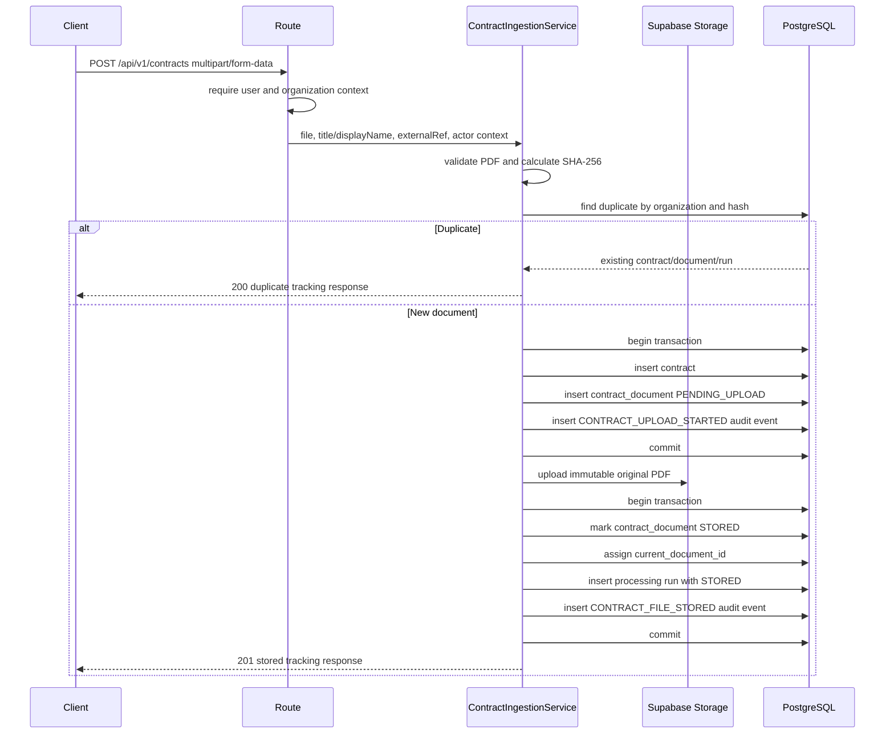

# Contract Ingestion

## Business Purpose

The contract ingestion module accepts original contract PDFs, validates them,
stores immutable originals in private object storage, records durable metadata in
PostgreSQL, writes audit events, and returns stable identifiers for future
processing.

This module does not parse PDFs, run OCR, call Groq for extraction, generate
obligations, schedule reminders, or create frontend upload UI.

## Module Boundaries

```text
Route
  -> auth context middleware
  -> multipart middleware
  -> controller
  -> ContractIngestionService
  -> repository interfaces
  -> PostgreSQL
```

The service depends on:

- `ContractRepository`
- `ContractDocumentRepository`
- `ContractProcessingRepository`
- `AuditRepository`
- `StorageProvider`
- `FileHashService`
- `TransactionManager`

Supabase-specific code stays in infrastructure storage. PostgreSQL SQL stays in
repository implementations. Upload does not enqueue downstream processing.

## Ingestion Flow



## Upload API

`POST /api/v1/contracts`

Headers:

- `x-user-id`: authenticated user UUID
- `x-organization-id`: authenticated organization UUID

Body: `multipart/form-data`

Accepted fields:

- `file`: required PDF
- `title`: optional string
- `displayName`: optional string
- `externalRef`: optional string

The endpoint does not accept parties, values, dates, renewal terms, notice
periods, obligations, confidence scores, or extracted text.

Successful stored response uses HTTP `201`. Duplicate response uses HTTP `200`.
Upload does not enqueue parsing, OCR, LLM extraction, or obligation creation.

## Processing Status API

`GET /api/v1/contracts/:contractId/processing-status`

The endpoint requires the same request context headers and scopes lookup by
organization ID.

## File Validation

Validation order:

1. File field exists.
2. File is not empty.
3. File is within `CONTRACT_MAX_FILE_SIZE_MB`.
4. Extension is `.pdf`.
5. MIME type is `application/pdf`.
6. Magic bytes begin with `%PDF-`.
7. Filename is sanitized for display.
8. PDF has a minimal `%%EOF` marker and is not encrypted.
9. SHA-256 is generated.

Domain errors include:

- `MISSING_CONTRACT_FILE`
- `EMPTY_CONTRACT_FILE`
- `UNSUPPORTED_DOCUMENT_TYPE`
- `FILE_TOO_LARGE`
- `INVALID_PDF_SIGNATURE`
- `INVALID_PDF`
- `PASSWORD_PROTECTED_PDF`
- `MALFORMED_MULTIPART`
- `STORAGE_UPLOAD_FAILED`
- `CONTRACT_PERSISTENCE_FAILED`

## Storage Strategy

Original PDFs are stored in the configured private Supabase Storage bucket.

Generated object key:

```text
organizations/{organizationId}/contracts/{contractId}/documents/{documentId}/original.pdf
```

The database stores provider, bucket, and object key. It does not store PDF
buffers or permanent public URLs.

## Database Schema

Migration:

- `packages/database/migrations/202607210001_contract_ingestion.up.sql`

Tables:

- `contracts`
- `contract_documents`
- `contract_processing_runs`

Important constraints:

- positive document version
- positive file size
- unique storage key
- unique `(contract_id, version_number)`
- unique active `(organization_id, file_hash_sha256)` for `PENDING_UPLOAD` and `STORED`
- valid SHA-256 format
- constrained status/source values
- upload status lifecycle: `PENDING_UPLOAD`, `STORED`, `UPLOAD_FAILED`

## Duplicate Handling

The service checks for an existing document by `(organization_id,
file_hash_sha256)` before uploading. The database partial unique index remains
the final authority for concurrent active uploads. If PostgreSQL reports
`23505` during pending metadata creation, the service returns the winning
persisted document when available and does not upload a second object.

## Failure Compensation

Storage failure:

- pending metadata is marked `UPLOAD_FAILED`
- safe failure metadata and an audit event are recorded when possible
- controlled `STORAGE_UPLOAD_FAILED` error is returned

Database failure after storage succeeds:

- service attempts to delete the uploaded object
- cleanup failure is logged
- pending metadata is marked `UPLOAD_FAILED` when possible
- success is not returned

No queue handoff occurs in this module. PDF buffers, extracted text, storage
secrets, and signed URLs are not queued or persisted.

## CUAD Importer

Command:

```bash
corepack pnpm import:cuad-subset
```

The importer:

- reads `working-subset/manifest.json`
- validates the 25-entry subset with Zod
- rejects duplicate IDs, filenames, paths, and hashes
- resolves paths safely under `working-subset/`
- calculates SHA-256 for every PDF
- rejects modified or corrupted files
- calls `ContractIngestionService`
- uses `sourceType: "CUAD_SEED"`
- preserves dataset provenance in `sourceReference`
- continues independent files after runtime failures
- exits nonzero when any file fails

## Environment Variables

- `CONTRACT_MAX_FILE_SIZE_MB`
- `CONTRACT_MAX_PAGE_COUNT`
- `CUAD_IMPORT_CONCURRENCY`
- `INGESTION_DEFAULT_ORGANIZATION_ID`
- `INGESTION_DEFAULT_USER_ID`
- existing PostgreSQL, Supabase Storage, and logging variables

## Commands

```bash
corepack pnpm --filter @contract-obligation-tracker/api run check:connections
corepack pnpm --filter @contract-obligation-tracker/api run import:cuad-subset
corepack pnpm --filter @contract-obligation-tracker/api run test:unit
corepack pnpm typecheck
corepack pnpm test
corepack pnpm build
```

## Testing

Current tests cover:

- missing file
- empty file
- invalid extension
- invalid MIME type
- fake PDF bytes
- file size limit
- SHA-256 generation
- safe storage key generation
- manifest validation
- duplicate manifest IDs
- invalid SHA-256
- path traversal rejection
- storage failure behavior
- database failure compensation
- duplicate upload behavior
- concurrent duplicate unique-violation resolution
- audit event write path

## Current Limitations

- The route uses header-based request context until the auth module is fully
  implemented.
- Minimal PDF validation does not parse page trees.
- The processing worker still does not parse PDFs and is not triggered by upload.
- The importer is implemented, but should be run only after database migrations
  are applied.
- Malware scanning is documented as future hardening.

## Next Module Boundary

The next module should consume the stored document and implement:

```text
Stored PDF
  -> page-aware PDF parsing
  -> OCR requirement detection
  -> normalized page and line representation
```
