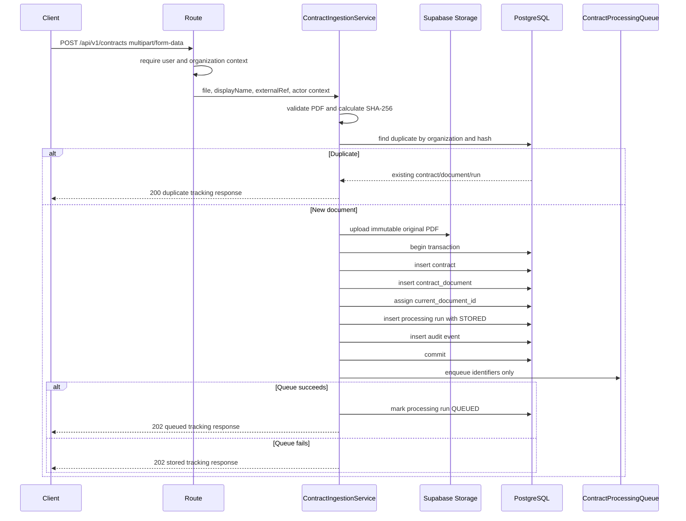

# Contract Ingestion

## Business Purpose

The contract ingestion module accepts original contract PDFs, validates them,
stores immutable originals in private object storage, records durable metadata in
PostgreSQL, writes an audit event, and hands off identifiers for future
processing.

This module does not parse PDFs, run OCR, call Gemini for extraction, generate
obligations, schedule reminders, or create frontend upload UI.

## Module Boundaries

```text
Route
  -> auth context middleware
  -> multipart middleware
  -> controller
  -> ContractIngestionService
  -> repository interfaces
  -> PostgreSQL
```

The service depends on:

- `ContractRepository`
- `ContractDocumentRepository`
- `ContractProcessingRepository`
- `AuditRepository`
- `StorageProvider`
- `FileHashService`
- `ContractProcessingQueue`
- `TransactionManager`

Supabase-specific code stays in infrastructure storage. PostgreSQL SQL stays in
repository implementations. Queue implementation stays behind
`ContractProcessingQueue`.

## Ingestion Flow



## Upload API

`POST /api/v1/contracts`

Headers:

- `x-user-id`: authenticated user UUID
- `x-organization-id`: authenticated organization UUID

Body: `multipart/form-data`

Accepted fields:

- `file`: required PDF
- `displayName`: optional string
- `externalRef`: optional string

The endpoint does not accept parties, values, dates, renewal terms, notice
periods, obligations, confidence scores, or extracted text.

Successful queued response uses HTTP `202`. Duplicate response uses HTTP `200`.
Queue failure after persistence returns HTTP `202` with `status: "STORED"`.

## Processing Status API

`GET /api/v1/contracts/:contractId/processing-status`

The endpoint requires the same request context headers and scopes lookup by
organization ID.

## File Validation

Validation order:

1. File field exists.
2. File is not empty.
3. File is within `CONTRACT_MAX_FILE_SIZE_MB`.
4. Extension is `.pdf`.
5. MIME type is `application/pdf`.
6. Magic bytes begin with `%PDF-`.
7. Filename is sanitized for display.
8. PDF has a minimal `%%EOF` marker and is not encrypted.
9. SHA-256 is generated.

Domain errors include:

- `MISSING_CONTRACT_FILE`
- `EMPTY_CONTRACT_FILE`
- `UNSUPPORTED_DOCUMENT_TYPE`
- `FILE_TOO_LARGE`
- `INVALID_PDF_SIGNATURE`
- `INVALID_PDF`
- `PASSWORD_PROTECTED_PDF`
- `STORAGE_UPLOAD_FAILED`
- `CONTRACT_PERSISTENCE_FAILED`

## Storage Strategy

Original PDFs are stored in the configured private Supabase Storage bucket.

Generated object key:

```text
organizations/{organizationId}/contracts/{contractId}/documents/{documentId}/original.pdf
```

The database stores provider, bucket, and object key. It does not store PDF
buffers or permanent public URLs.

## Database Schema

Migration:

- `packages/database/migrations/202607210001_contract_ingestion.up.sql`

Tables:

- `contracts`
- `contract_documents`
- `contract_processing_runs`

Important constraints:

- positive document version
- positive file size
- unique storage key
- unique `(contract_id, version_number)`
- unique `(organization_id, file_hash_sha256)`
- valid SHA-256 format
- constrained status/source values

## Duplicate Handling

The service checks for an existing document by `(organization_id,
file_hash_sha256)` before uploading. The database unique constraint remains the
final authority for concurrent uploads. If PostgreSQL reports `23505`, the
service attempts storage cleanup and returns the winning persisted document when
available.

## Failure Compensation

Storage failure:

- no database records are written
- controlled `STORAGE_UPLOAD_FAILED` error is returned

Database failure after storage succeeds:

- service attempts to delete the uploaded object
- cleanup failure is logged
- success is not returned

Queue failure after database commit:

- stored contract is preserved
- processing run remains `STORED`
- warning is logged
- client receives accepted tracking response

## Queue Handoff

Queue payload contains identifiers only:

```ts
interface ProcessContractJobData {
  processingRunId: string;
  contractId: string;
  documentId: string;
  organizationId: string;
}
```

Deterministic job ID:

```text
contract-processing:{documentId}
```

PDF buffers, extracted text, storage secrets, and signed URLs are not queued.

## CUAD Importer

Command:

```bash
corepack pnpm import:cuad-subset
```

The importer:

- reads `working-subset/manifest.json`
- validates the 25-entry subset with Zod
- rejects duplicate IDs, filenames, paths, and hashes
- resolves paths safely under `working-subset/`
- calculates SHA-256 for every PDF
- rejects modified or corrupted files
- calls `ContractIngestionService`
- uses `sourceType: "CUAD_SEED"`
- preserves dataset provenance in `sourceReference`
- continues independent files after runtime failures
- exits nonzero when any file fails

## Environment Variables

- `CONTRACT_MAX_FILE_SIZE_MB`
- `CONTRACT_MAX_PAGE_COUNT`
- `CUAD_IMPORT_CONCURRENCY`
- `INGESTION_DEFAULT_ORGANIZATION_ID`
- `INGESTION_DEFAULT_USER_ID`
- existing PostgreSQL, Supabase Storage, job, and logging variables

## Commands

```bash
corepack pnpm --filter @contract-obligation-tracker/api run check:connections
corepack pnpm --filter @contract-obligation-tracker/api run import:cuad-subset
corepack pnpm --filter @contract-obligation-tracker/api run test:unit
corepack pnpm typecheck
corepack pnpm test
corepack pnpm build
```

## Testing

Current tests cover:

- missing file
- empty file
- invalid extension
- invalid MIME type
- fake PDF bytes
- file size limit
- SHA-256 generation
- safe storage key generation
- manifest validation
- duplicate manifest IDs
- invalid SHA-256
- path traversal rejection
- storage failure behavior
- database failure compensation
- queue failure behavior
- duplicate upload behavior
- audit event write path

## Current Limitations

- The route uses header-based request context until the auth module is fully
  implemented.
- Minimal PDF validation does not parse page trees.
- The processing worker still does not parse PDFs.
- The importer is implemented, but should be run only after database migrations
  are applied.
- Malware scanning is documented as future hardening.

## Next Module Boundary

The next module should consume the stored document and implement:

```text
Stored PDF
  -> page-aware PDF parsing
  -> OCR requirement detection
  -> normalized page and line representation
```
